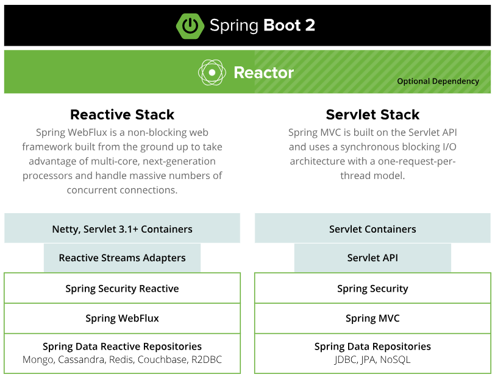

<h1>SPRING WEBFLUX</h1>

Es la nueva arquitectura que propone spring para la creación de aplicaciones reactivas. Esta disponible desde la version 5 de spring.

La programación reactiva es un paradigma basado en programación funcional, los api streams de java y combinado con el patron observer indica que las aplicaciones deben reaccionar ante eventos

<b>Spring Webflux</b> es un módulo web reactivo, totalmente sin bloqueo, que admite contrapresión de flujos reactivos y se ejecuta en servidores como netty, Undertow y contenedores Servlet 3.1+.

<h2>Microservicios reactivos</h2>

Una de las razones principales por las que los desarrolladores pasan del código de bloqueo al código sin bloqueo es la eficiencia. El código reactivo hace más trabajo con menos recursos. Project Reactor y Spring WebFlux permiten a los desarrolladores aprovechar los procesadores multinúcleo de próxima generación, que manejan cantidades potencialmente masivas de conexiones simultáneas. Con el procesamiento reactivo, puede satisfacer a más usuarios simultáneos con menos instancias de microservicio.

<h2>Microservicios reactivos con Spring Boot</h2>
La cartera Spring proporciona dos pilas paralelas. Uno se basa en una API de Servlet con construcciones Spring MVC y Spring Data. La otra es una pila totalmente reactiva que aprovecha los repositorios reactivos de Spring WebFlux y Spring Data. En ambos casos, Spring Security lo tiene cubierto con soporte nativo para ambas pilas.

